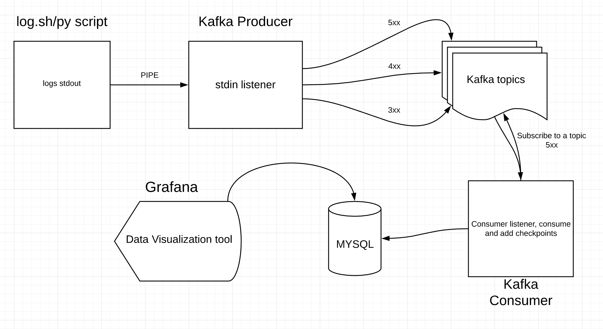
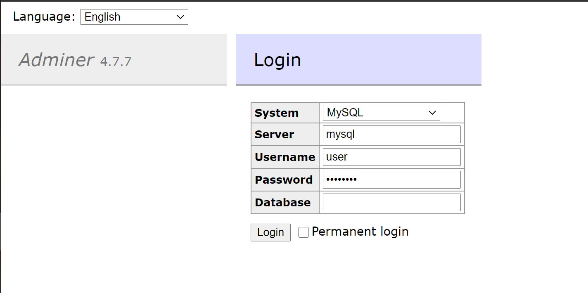
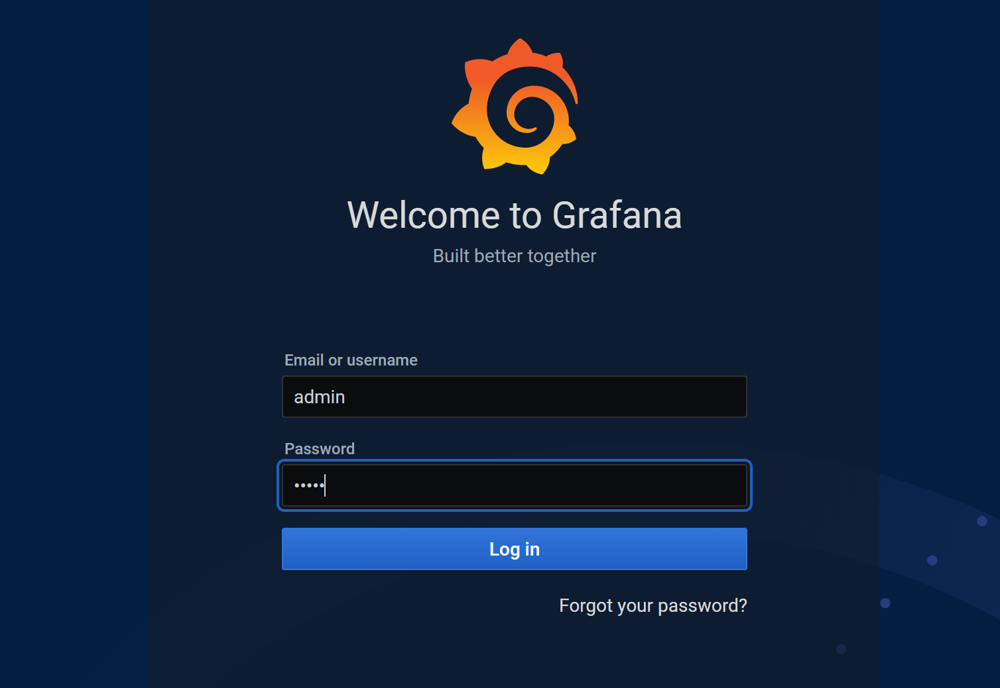
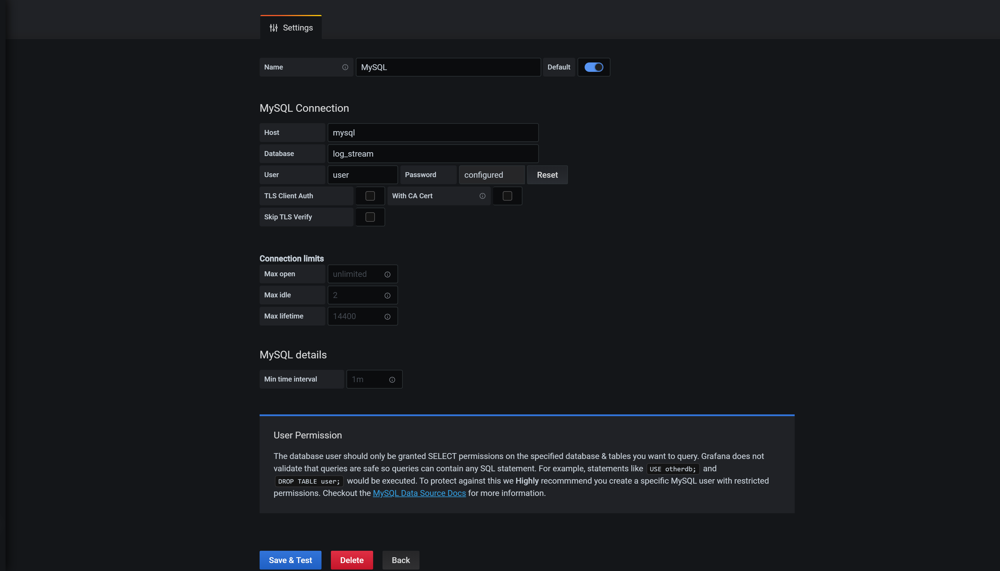
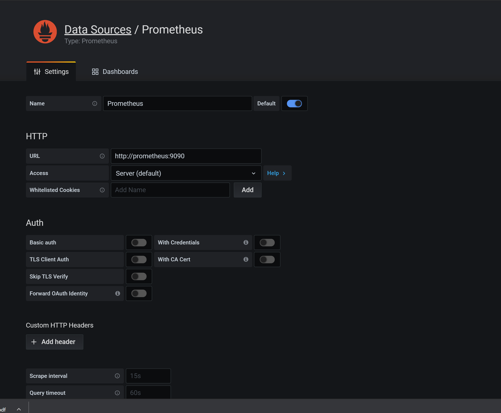
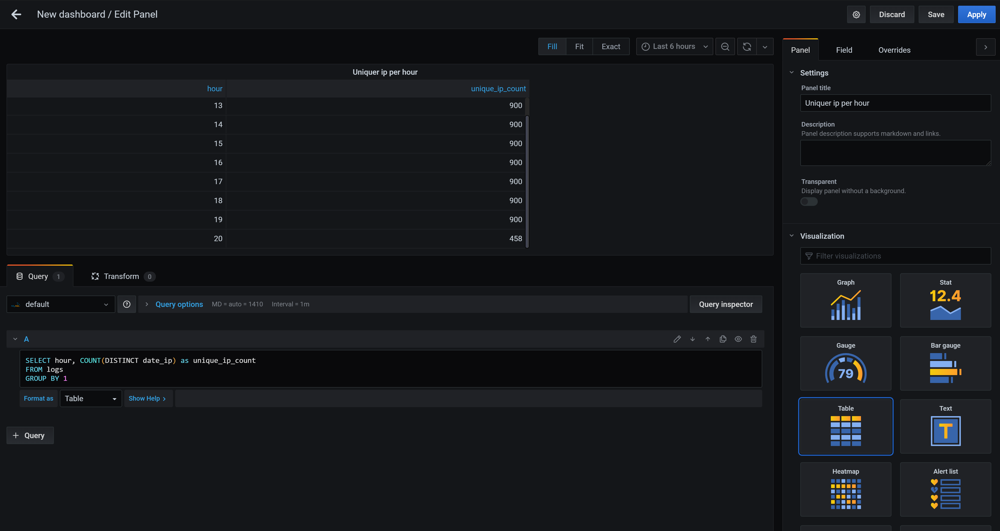
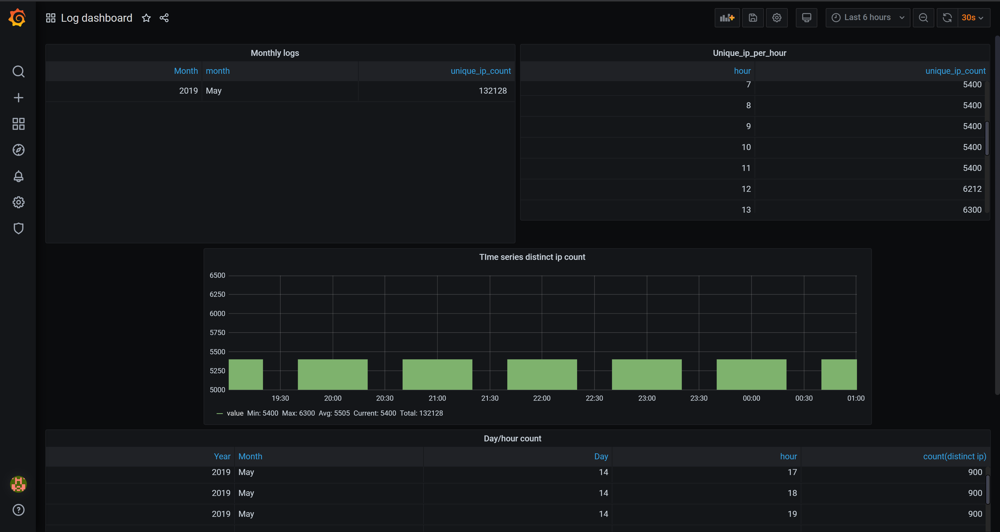
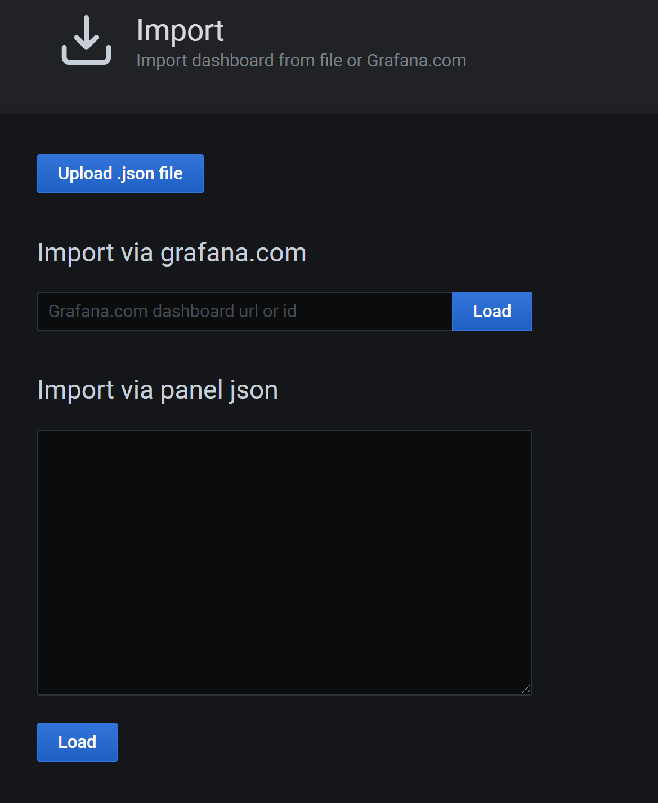
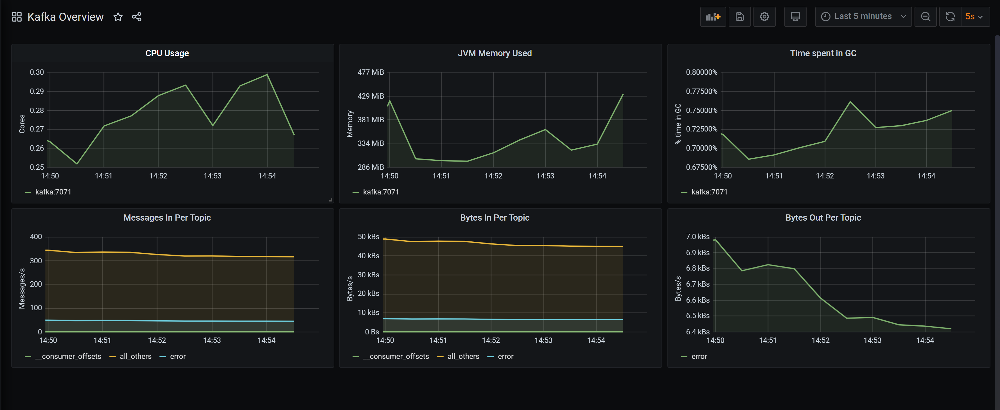

## Data Stream with Kafka, MySQL and Grafana
<br>



<br>
Multi-container Docker app built from the following services:

* [kafka/Zookeeper](https://kafka.apache.org/) - distributed streaming platform
* [Adminer](https://www.adminer.org/) - admin UI for Databases
* [Grafana](https://grafana.com/) - visualization UI
* [MySQL](https://www.mysql.com/) - Database
* [Prometheus](https://prometheus.io/) - Used for collecting Kafka logs
* [Sonarqube ](https://www.sonarqube.org/) - Code analysis platflorm (NOT IMPLEMENTED ATM)


## Quick Start
In order to run this project you need to have Python, docker plus docker-compose installed
on your local machine.

To start the app:

1. Install [docker/docker-compose](https://docs.docker.com/compose/install/).
1. Install [Python](https://www.python.org/downloads/).
1. Check if docker/docker-compose installed correctly
    <br />. ```docker --version ```.
    <br />. ```docker-compose --version ```.
1. Clone this repo.
1. Run the following command from the root of the cloned repo:
     <br /> . ```pip3 install -r requirements.txt (Python 3)``` to install python libs 
     for this project.


## Ports
The services in the project run on the following ports 
(you can confirm if the services started properly) :

Host Port | Service
------------ | -------------
| http://localhost:3000/      | Grafana       |
|http://localhost:8080/       | Adminer       | 
|http://localhost:9090/       | Prometheus    | 
|:9092       | Kafka         | 

## Users

The service creates two admin users - one for MySQL and one for Grafana. 

- `MYSQL_USER=user`
- `MYSQL_PASSWORD=userpass`
- `MYSQL_ROOT_PASSWORD=admin`
- `GF_SECURITY_ADMIN_USER=admin`
- `GF_SECURITY_ADMIN_PASSWORD=admin`

## MySQL Database
The service creates a default database called `log_stream`.

## Adminer login
[Adminer Page](http://localhost:8080/ ) and fill out the details
<br> 
<br> 


## Grafana
Our grafana will be reading data from our mysql db in almost real time depending on the
refresh rate.
Browse  [Grafana Page](http://localhost:3000/ ) and fill out the username and password 
and add the datasource 
for mysql and Prometheus as shown below. click login and skip password change.
<br>
<br>
<br>
#### Grafana datasource setup
Setup and save
<br>
<br>
```MSQL DataSource```
<br>
<br>
<br>
<br>
```Prometheus DataSource```
<br>
<br>
<br>


#### Grafana Dashboard
By default, the app does not create any Grafana dashboards. But we will create
2 or 3 table dashboard to monitor unique ips per hour etc using sql queries.
To make additional dashboards, see the Grafana 
[documentation](https://grafana.com/docs/grafana/latest/features/datasources/mysql/#time-series-queries)
<br>or<br>
[Youtube](https://www.youtube.com/watch?v=4qpI4T6_bUw&fbclid=IwAR3Qx-1hyKk3WQXNzywswMFT22aFquRyKzA227ykxJdNhh___-we0FkduEg)
<br>
<br>
<br>
<br>

#### Plotting the monitoring visualization on Grafana (Prometheus)
Now that we have configured Kafka JMX metrics to pipe into Prometheus, it's time to 
visualize it in Grafana. 

One way to create a dashboard in Grafana is to manually configure the panels one by one, 
or to kickstart our process, we can download the pre-configured dashboard from the 
[Download JSON](https://grafana.com/api/dashboards/721/revisions/1/download) 
or get it from scripts dir and import it into your Grafana.

<br>

<br>


## Usage
* utils.py
```
Dependencies:
    logging
    sys
    pathlib
    pymysql
```
This module is responsible for little micro functions services mainly 
such as setting up logging, db connections, topic dict etc.

* DataStream_producer.py
```
Dependencies:
    subprocess
    ast
    KafkaProducer
    json
```
Kafka Producer reads stdout logs from logs.sh and pushes it to different topics.

* DataStream_consumer.py
```
Dependencies:
   KafkaConsumer
   json
   datetime
```
Kafka consumer which consumers and keeps track of data consumed from the producer.

* logs.sh/logs.py
```
Produces the logs consumed by kafka. Both file produces same logs
but the logs.py is faster.
```


* grafana.sql
```
Contains some sql script for grafana dashboard to view
tables in real time.
```


## Script Execution
<b> &#x1F499; 💙 NOTE - Project was developed and tested on windows but should work
similarly with Linux and Mac, Just you may need to change Python to Python3 
 in - run.sh - if necessary
&#x1F499; 💙
</b> 

- If you get an error ```No module name app``` - please use ```python3``` in ```run.sh```
<br>

To start the service and run the project simple open the `terminal` (Linux/Mac) 
or `Git Bash`(for windows) on the `project root dir` exec the command below 

- run : ` bash run.sh`

- To stop the process, kill the PID - `ps aux` and `kill PID`

- Stop docker container - `docker-compose down` on the project root dir 
 and `docker system prune -a` to remove all stopped containers.


P.S - Dont hesitate to reach out on [linkedin](https://www.linkedin.com/in/johnleonard-onwuzuruigbo-9a10868a/) if there are any issues .